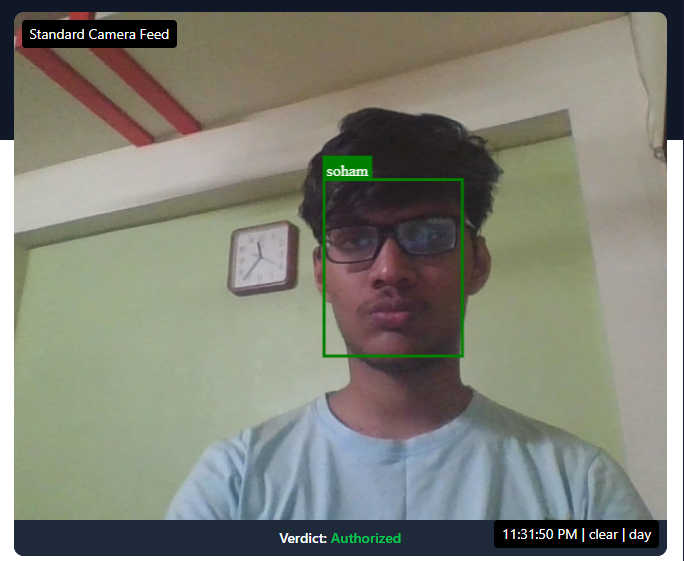
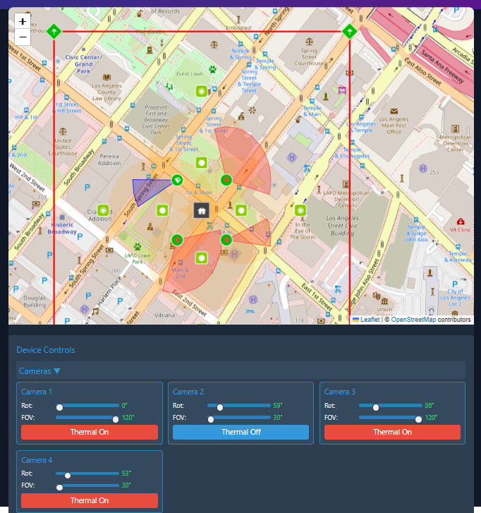

# Advanced Surveillance System

## Project Overview
This project was developed as part of the CodeCrafter Hackathon, where the challenge was to build an advanced surveillance system using AI/ML and various sensors like cameras, lasers, radar, and fiber optics. Initially stunned by the complexity of the task, our team transformed the challenge into an opportunity, creating a high-security headquarters simulation on a dynamic map that adapts in real-time to environmental conditions. The journey from hesitant beginnings to a fully functional system, culminating in a 3rd runner-up podium finish, was intense but incredibly rewarding.

## Team
- Soham Bhaye
- Pushkar Mhatre
- Sujal Shah
- Oshnikdeep Tiwari

## Features

### 1. Object Detection
- Our system detects objects only when the laser is interrupted, ensuring precision and reducing false alarms.
- **Image Demo**:  
  
   
  (Shows a soldier crossing a laser grid with detection events logged.)

### 2. Facial Authentication
- Only authenticated users with a unique facial identity can enter the headquarters.
- **Image Demo**:  
    
  (Displays a standard camera feed with a "Verdict: Authorized" result.)
  
### 3. Environmental Adaptation
- The system adapts based on weather and visibility conditions (e.g., rain, fog, day, and night) to determine the best-performing sensor in real-time.
- **Image Demo**:  
    
  (Displays a thermal camera feed with device controls for different conditions.)

### 4. Sensor Fusion
- Integrated data from multiple sensors (camera, laser, radar, and fiber optic) to enhance accuracy and decision-making.
- **Image Demo**:  
    
  (Shows a dynamic map with overlapping sensor ranges in green, blue, and red.)

### 5. Weapon Detection
- The system identifies potential weapons (e.g., knives) in real-time using AI-based object recognition, triggering a "BREACH DETECTED" alert when detected.
- **Image Demo**:  
    
  (Shows a person holding a knife with a breach alert and accuracy score.)

### 6. Buried Fiber Optic Frequency
- Utilizes buried fiber optic sensors to detect vibrations or movements, providing frequency data to identify potential intrusions or activities underground.
- **Image Demo**:  
    
  (Displays a graph of fiber optic frequency data overlaid on a map.)

### 7. Laser Simulation
- Tracks objects crossing the laser barrier, calculating distance and speed to assess potential threats.
- **Image Demo**:  
    
  (Shows a laser grid with a soldier and speed estimation details.)

### 8. Speech Recognition for Alerts
- Implements real-time speech recognition to generate alerts based on specific threat-related keywords or commands, ensuring quick response times.
- **Note**: This feature is demonstrated through logged events and can be tested with audio input in the system.

### 9. Multilingual Chatbot
- An AI-powered chatbot capable of understanding and responding to queries in multiple languages, making the system more user-friendly and accessible.
- **Note**: Demo available upon running the chatbot module.

## Technologies Used
- **Machine Learning**: TensorFlow, OpenCV  
- **Backend**: Python (Flask/FastAPI)  
- **Frontend**: React.js, TypeScript, Tailwind CSS, ShadCN  
- **Database**: PostgreSQL  
- **Authentication**: Clerk (3FA Authentication System)  

